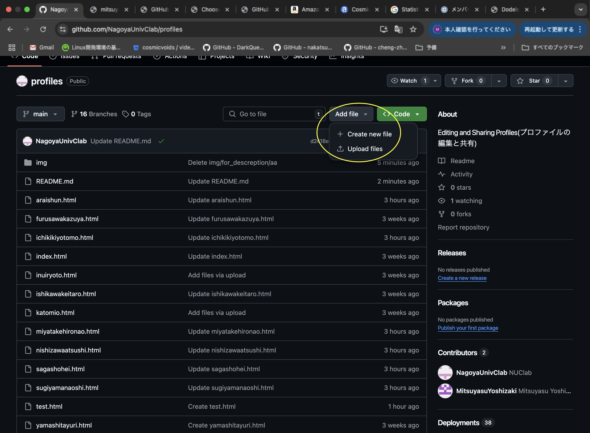
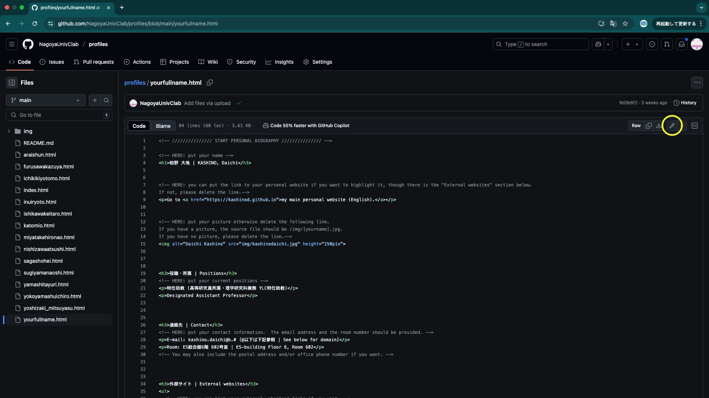
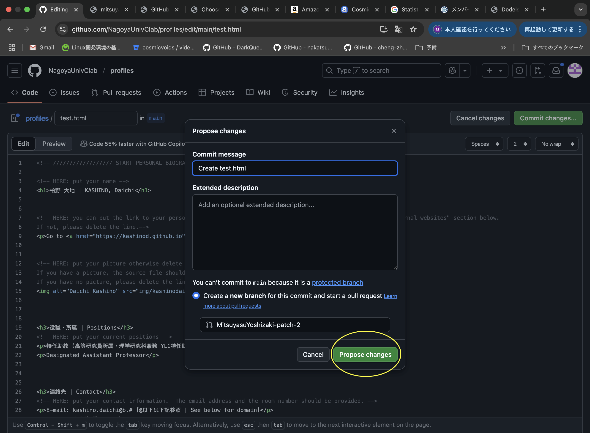
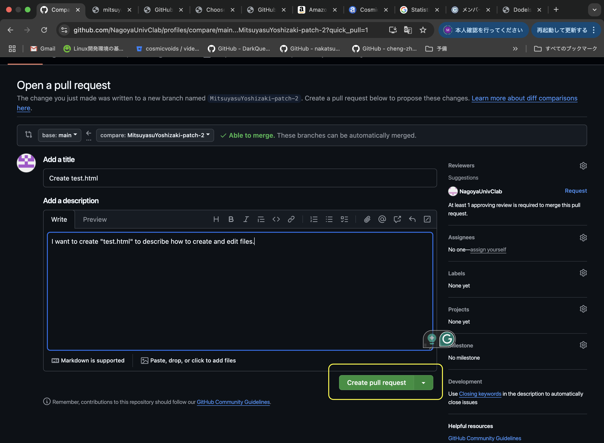

# profiles
このリポジトリはC研のホームページのメンバーにある個人のhtmlファイルの管理、編集を目的として作成されています。
このリポジトリにより、このリポジトリ内のファイルを編集し、web係から変更を承認されることで、C研HPでの個人ページの表示に反映されます。
※反映には、web係からの承認後、少し時間がかかります。
Editing and Sharing Profiles(プロファイルの編集と共有)

## <ルール>
このレポジトリで、自分のhtmlファイルをyourfullname.htmlの中のコードを全てコピーし、新たなファイルにペーストしてから作成してください。
htmlファイルの変更は、該当ファイル名をクリックして、右上に鉛筆マークをクリックすると、コードを書き換えることができます。
しかしファイルの作成・変更にはpull requestとなり、web係によって認証され次第、実際にファイルが作成・変更されます。
具体的な編集方法は以下にまとめています。

### <ファイルの作成方法>
この操作で使うタグは黄色の実線で囲まれた３つのタグです。
"Add file"をクリックして、"Create new file"をクリックすると、新しいファイルを作成できます。
もし、画像やローカルで編集したファイルをアップロードしたい場合には"Upload files"をクリックして、当該ファイルをgithubの画面内にドラッグするか、ファイルを選択してください。

図1. ファイルの追加に使うタグ

### <ファイルの編集方法>
1. 編集の開始

図2にある黄色の実線で囲んだタグをクリックすると編集が始まります。右上に"Commit changes"と書かれた緑のタグがあれば、編集用の画面が開かれています。

図2. 鉛筆マークの位置

2. 変更の提案

編集が終わったら、"Commit changes"という緑色のタグをクリックします。その後、図3のような黄色の実線内の"Propose changes"をクリックすると、管理者にファイルの変更を提案することができます。
<!--そして上の小さなセルには、どのファイルを編集したか(例：Update _yourname_.html)を記入してください。-->

図3. ファイルの変更についての提案に使うタグ

3. 編集の終了(Pull requestの生成)

本来なら手順2までで編集が完了しますが、ここでは共同のリポジトリでのファイルの追加・編集を行うので、管理者に認証された場合にのみ編集が反映されるようなシステムになっています。
このシステムのために、Pull requestを生成する必要があります。Pull requestは図4のような黄色の実線内の"Create pull request"をクリックすることで、生成することができます。
Pull requestが認証されると、変更点が反映され、個人ページが変わるため、操作は以上になります。お疲れ様でした。

図4. Pull requestの作成に使うタグ
<!---->
# 改善点があれば、是非とも教えてください!

わからない手順や予期せぬことが生じた場合には、web係までご相談ください。

## <メモ>
HPなどを新たなタブに表示する方法: <a href="参照したいURL" **target="_blank" rel="noopener noreferrer"**>(青文字にしたい部分)</a>
